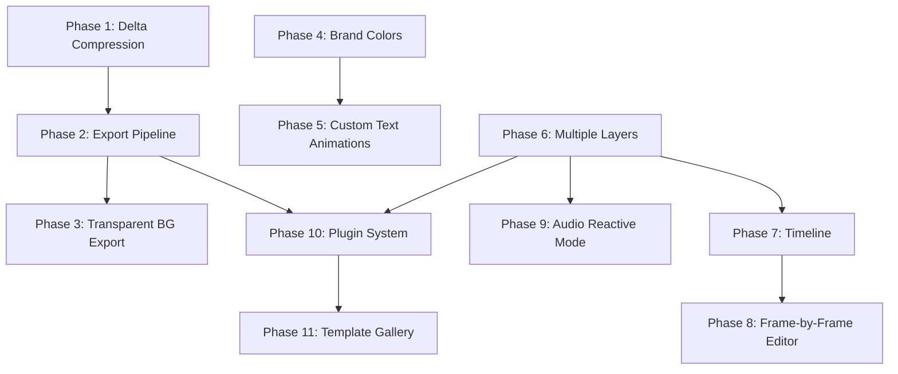

# Tenix — Feature Implementation Plan

> 11 major features, sequenced so each phase builds on a stable foundation.  
> Total: ~10 phases, estimated 85-120 new/modified files.

---

## Dependency Graph — Why This Order



**Why this order:**
1. **Delta Compression** (Phase 1) — Fixes an existing problem (100MB recordings). Zero risk to existing features. Improves the recording system that export depends on.
2. **Export Pipeline** (Phase 2) — Highest user impact. Depends on the recording system being stable. No architecture changes needed.
3. **Transparent BG Export** (Phase 3) — Extends the export pipeline from Phase 2. Requires changing the canvas renderer to support alpha.
4. **Brand Colors** (Phase 4) — Small, self-contained UI feature. No dependencies on anything else. Creates the color palette system that text animations and templates will use.
5. **Custom Text Animations** (Phase 5) — Extends the existing animation system + font system. Benefits from brand color palettes. No architecture changes.
6. **Multiple Layers** (Phase 6) — **Major architecture change.** This is the most complex phase and the foundation for timeline and frame-by-frame editing. Must be done before those features.
7. **Timeline** (Phase 7) — Depends on layers being stable. Adds sequencing and keyframes.
8. **Frame-by-Frame Editor** (Phase 8) — Depends on both layers and timeline.
9. **Audio Reactive Mode** (Phase 9) — Depends on the effects engine and layers. Standalone otherwise.
10. **Plugin System** (Phase 10) — Needs all core features stable before defining a plugin API. Depends on export, layers, effects being finalized.
11. **Template Gallery** (Phase 11) — Needs plugins and all features to be stable. Templates are essentially "packaged configurations" of all features.

---

## Phase 1: Delta Compression for Session Recordings

**Goal:** Reduce recording memory/disk usage by 80-95% by storing only changed cells between frames.

**Risk:** Low — internal format change with backward-compatible import.

> [!NOTE]
> Current state: each frame stores a full `Uint8ClampedArray` (cols × rows × 3 bytes). A 30fps × 60s recording on a 192×108 grid = 1,800 frames × ~62KB each = **~112MB in memory**.

### Files to Modify

#### [MODIFY] [sessionRecorder.ts](file:///Users/appointy/work/led-board/app/lib/sessionRecorder.ts)

**Changes:**
- Add a `DeltaFrame` type alongside `RecordedFrame`:
  ```typescript
  interface DeltaFrame {
    ts: number;
    /** Indices of changed cells (flat index into cols*rows grid) */
    changedIndices: Uint32Array;
    /** RGB values for changed cells (changedIndices.length * 3 bytes) */
    changedValues: Uint8ClampedArray;
  }
  ```
- Modify `_captureFrame()`:
  - Keep a `_prevFrameData: Uint8ClampedArray | null` reference
  - On frame 0: store full frame (keyframe). Copy current data into `_prevFrameData`.
  - On subsequent frames: compare current data vs `_prevFrameData`, record only changed cell indices + new RGB values. Update `_prevFrameData`.
  - Insert a full keyframe every N frames (e.g. every 30 frames = 1 per second) so seeking/random access is efficient.
- Modify `_renderFrame()`:
  - Maintain a `_reconstructedFrame: Uint8ClampedArray` buffer
  - For keyframes: copy directly
  - For delta frames: apply changes on top of reconstructed buffer
- Modify `_playbackLoop`:
  - When seeking backward or to arbitrary position: find the nearest keyframe before the target, then apply deltas forward
- Update `RecordingFile` to version 2:
  - `version: 2` with fields for delta-encoded data
  - Keep backward compatibility: if `version === 1`, use the old full-frame import path
- Update `exportToFile()` and `importFromFile()` for the new format

### Files to Add

#### [NEW] [deltaCodec.ts](file:///Users/appointy/work/led-board/app/lib/deltaCodec.ts)

Pure utility module for delta encoding/decoding:
```typescript
export function encodeDelta(
  prev: Uint8ClampedArray,
  curr: Uint8ClampedArray,
  cols: number,
  rows: number
): { changedIndices: Uint32Array; changedValues: Uint8ClampedArray }

export function applyDelta(
  target: Uint8ClampedArray,
  changedIndices: Uint32Array,
  changedValues: Uint8ClampedArray
): void
```

### Testing
- Record a 30-second session with patterns + effects
- Verify playback is frame-identical to full-frame recording
- Measure memory usage: target >80% reduction
- Test import of old v1 `.tenix-rec` files still works
- Test seeking (scrubbing) during playback — should reconstruct correctly

---

## Phase 2: Export to Video/GIF

**Goal:** Export canvas content as GIF, WebM, or MP4 that users can share on social media.

**Risk:** Low — additive feature, no existing code changes needed.

### Files to Add

#### [NEW] [exporter.ts](file:///Users/appointy/work/led-board/app/lib/exporter.ts)

Central export orchestrator:
```typescript
export type ExportFormat = 'gif' | 'webm' | 'mp4' | 'png' | 'svg';
export type ExportQuality = 'low' | 'medium' | 'high';

export interface ExportOptions {
  format: ExportFormat;
  quality: ExportQuality;
  width: number;   // output pixel width
  height: number;  // output pixel height
  fps: number;
  duration?: number; // auto from recording or manual
  loop?: boolean;   // for GIF
  transparent?: boolean; // Phase 3
}

export async function exportFromRecording(
  recorder: SessionRecorder,
  canvas: HTMLCanvasElement,
  options: ExportOptions,
  onProgress?: (pct: number) => void
): Promise<Blob>

export async function exportCurrentFrame(
  canvas: HTMLCanvasElement,
  format: 'png' | 'svg',
  options: { width: number; height: number; transparent?: boolean }
): Promise<Blob>
```

#### [NEW] [gifEncoder.ts](file:///Users/appointy/work/led-board/app/lib/gifEncoder.ts)

Lightweight GIF encoder (LZW + color quantization):
- Use median-cut quantization to reduce to 256 colors per frame
- LZW compression for each frame
- Support loop count (0 = infinite)
- Target: no external dependencies, ~300 lines

> [!IMPORTANT]
> If the pure-JS GIF encoder is too slow for long recordings, we can swap in a WASM-based encoder later (Phase 10 plugin system). The API surface stays the same.

#### [NEW] [videoEncoder.ts](file:///Users/appointy/work/led-board/app/lib/videoEncoder.ts)

Tiered video export:
```typescript
// Tier 1: WebCodecs (hardware-accelerated, ~80% of users)
async function encodeWithWebCodecs(frames, options): Promise<Blob>

// Tier 2: MediaRecorder fallback (~97% of users)
async function encodeWithMediaRecorder(canvas, options): Promise<Blob>

// Auto-detect and use the best available
export async function encodeVideo(frames, canvas, options): Promise<Blob>
```

#### [NEW] [ExportPanel.tsx](file:///Users/appointy/work/led-board/app/components/ExportPanel.tsx)

UI panel in sidebar:
- Format selector: GIF / WebM / MP4 / PNG / SVG
- Quality selector
- Resolution multiplier (1× / 2× / 4×)
- Progress bar during export
- Download button
- "Export current frame" separate button

### Files to Modify

#### [MODIFY] [ControlPanel.tsx](file:///Users/appointy/work/led-board/app/components/ControlPanel.tsx)
- Add `<ExportPanel>` section between Recording and Effects panels
- Pass through recording state and canvas ref

#### [MODIFY] [LEDBoard.tsx](file:///Users/appointy/work/led-board/app/components/LEDBoard.tsx)
- Add export handler callbacks
- Wire ExportPanel props through ControlPanel
- Provide canvas ref access for export

#### [MODIFY] [Canvas.tsx](file:///Users/appointy/work/led-board/app/components/Canvas.tsx)
- Add `getCanvas()` to the `CanvasHandle` imperative ref (already exists — verify)
- Add a `renderToOffscreen(width, height): HTMLCanvasElement` method for high-res export

### Testing
- Export a recording as GIF → open in browser, verify animation plays
- Export as WebM → open in VLC/browser, verify video plays
- Export current frame as PNG → verify resolution matches selected multiplier
- Test on Chrome (WebCodecs path) and Safari/Firefox (MediaRecorder fallback)
- Test with transparent background (Phase 3 — skip for now)

---

## Phase 3: Transparent Background Export

**Goal:** Export animations/frames with alpha channel (transparent background) for use as overlays in video editors.

**Risk:** Low-Medium — requires modifying the canvas renderer to support alpha.

### Files to Modify

#### [MODIFY] [Canvas.tsx](file:///Users/appointy/work/led-board/app/components/Canvas.tsx)
- In `drawGrid()`, when exporting with transparent=true:
  - Don't fill black cells with `backgroundColor` — leave them transparent (RGBA = 0,0,0,0)
  - Skip the edge-fill step (the rightmost/bottom edges)
  - Grid lines should not be drawn in export mode
- Add a `renderForExport(width, height, transparent: boolean): HTMLCanvasElement` method

#### [MODIFY] [exporter.ts](file:///Users/appointy/work/led-board/app/lib/exporter.ts)
- Wire `transparent: true` option through to:
  - PNG export: use `canvas.toBlob('image/png')` (PNG natively supports alpha)
  - WebM: use VP9 codec with alpha (`vp09.00.10.08` profile)
  - GIF: GIF doesn't support true alpha — offer "transparency color" option (key out black cells)

#### [MODIFY] [ExportPanel.tsx](file:///Users/appointy/work/led-board/app/components/ExportPanel.tsx)
- Add "Transparent Background" toggle (disabled for MP4, auto-disabled for GIF with warning)

### Testing
- Export PNG with transparent BG → open in an image editor, verify alpha channel
- Export WebM with alpha → overlay on a video in a browser `<video>` element
- Verify GIF transparency key works (black cells become transparent)

---

## Phase 4: Brand Colors

**Goal:** Let users define a color palette that all patterns, effects, and text automatically use.

**Risk:** Low — purely additive UI + a palette context.

### Files to Add

#### [NEW] [palette.ts](file:///Users/appointy/work/led-board/app/lib/palette.ts)

```typescript
export interface ColorPalette {
  id: string;
  name: string;
  colors: RGB[];  // 2-8 colors
  isBuiltIn: boolean;
}

// Built-in palettes
export const BUILT_IN_PALETTES: ColorPalette[] = [
  { id: 'neon', name: 'Neon', colors: [[0,255,0], [255,0,255], [0,255,255], [255,255,0]], isBuiltIn: true },
  { id: 'sunset', name: 'Sunset', colors: [[255,94,77], [255,154,0], [255,206,0], [138,43,226]], isBuiltIn: true },
  { id: 'ocean', name: 'Ocean', colors: [[0,119,182], [0,180,216], [144,224,239], [202,240,248]], isBuiltIn: true },
  { id: 'fire', name: 'Fire', colors: [[255,0,0], [255,69,0], [255,165,0], [255,215,0]], isBuiltIn: true },
  { id: 'pico8', name: 'Pico-8', colors: [/* 16 pico-8 colors */], isBuiltIn: true },
  { id: 'gameboy', name: 'GameBoy', colors: [[15,56,15], [48,98,48], [139,172,15], [155,188,15]], isBuiltIn: true },
  // ... more
];

export function savePalettes(palettes: ColorPalette[]): void    // localStorage
export function loadPalettes(): ColorPalette[]
export function pickFromPalette(palette: ColorPalette, index: number): RGB
export function randomFromPalette(palette: ColorPalette): RGB
```

#### [NEW] [BrandColorPanel.tsx](file:///Users/appointy/work/led-board/app/components/BrandColorPanel.tsx)

- Displays current palette as color swatches
- Dropdown to select built-in palettes
- "Custom" option: add/remove/edit colors in the palette
- Click a swatch to set it as active drawing color
- Save/load custom palettes to localStorage

### Files to Modify

#### [MODIFY] [ControlPanel.tsx](file:///Users/appointy/work/led-board/app/components/ControlPanel.tsx)
- Add `<BrandColorPanel>` below the ColorPicker section
- Pass `activePalette` to pattern/animation sections

#### [MODIFY] [LEDBoard.tsx](file:///Users/appointy/work/led-board/app/components/LEDBoard.tsx)
- Add `activePalette` state
- Wire brand colors through to effects engine (for multi-color effects, cycle through palette instead of rainbow)

#### [MODIFY] [effects.ts](file:///Users/appointy/work/led-board/app/lib/effects.ts)
- When a palette is active and `isMulti=true`, cycle through palette colors instead of pure hue rotation

#### [MODIFY] [patterns.ts](file:///Users/appointy/work/led-board/app/lib/patterns.ts)
- Add palette-aware variants: patterns can accept an optional palette and use its colors instead of hardcoded values

### Testing
- Select a built-in palette → draw → verify colors come from palette
- Create custom palette → save → reload page → verify persisted
- Apply pattern with palette → verify pattern uses palette colors
- Trigger multi-color effects with palette → verify effects cycle palette

---

## Phase 5: Custom Text Animations

**Goal:** Add animated text entrance effects (typewriter, glitch, bounce, wave, fade-in, neon flicker).

**Risk:** Low — extends existing font system and animation manager.

### Files to Add

#### [NEW] [textAnimations.ts](file:///Users/appointy/work/led-board/app/lib/textAnimations.ts)

```typescript
export type TextAnimationType = 
  'typewriter' | 'glitch' | 'bounce' | 'wave' | 'fade' | 'neon' | 'matrix' | 'slide-in';

export interface TextAnimationConfig {
  name: string;
  type: TextAnimationType;
  fps: number;
  // Returns the animation tick function
  createTick(
    text: string,
    cols: number,
    rows: number,
    color: RGB,
    scale: number,
    palette?: ColorPalette
  ): (data: Uint8ClampedArray, frame: number) => boolean; // returns false when complete
}

export const TEXT_ANIMATIONS: TextAnimationConfig[] = [
  // Typewriter: reveals one character at a time
  { name: 'Typewriter', type: 'typewriter', fps: 8, createTick: ... },
  // Glitch: random character substitution then settling
  { name: 'Glitch', type: 'glitch', fps: 15, createTick: ... },
  // Bounce: text drops from top, bounces at bottom
  { name: 'Bounce', type: 'bounce', fps: 30, createTick: ... },
  // Wave: each character oscillates vertically with phase offset
  { name: 'Wave', type: 'wave', fps: 25, createTick: ... },
  // Fade: pixel-by-pixel random reveal (like existing Fade In but text-specific)
  { name: 'Fade In', type: 'fade', fps: 30, createTick: ... },
  // Neon: text flickers on/off with increasing stability
  { name: 'Neon Flicker', type: 'neon', fps: 15, createTick: ... },
  // Matrix: rain reveals text (like Matrix Reveal but text-targeted)
  { name: 'Matrix', type: 'matrix', fps: 20, createTick: ... },
  // Slide-in: text slides in from the right, character by character
  { name: 'Slide In', type: 'slide-in', fps: 20, createTick: ... },
];
```

Each animation function uses `renderChar()` from `font.ts` to render individual characters with position/visibility controlled per-frame.

### Files to Modify

#### [MODIFY] [PatternSelector.tsx](file:///Users/appointy/work/led-board/app/components/PatternSelector.tsx)
- Add a "Text Animation" dropdown in the text section
- When a text animation is selected, clicking "Render Text" starts it as a one-shot animation via the AnimationManager

#### [MODIFY] [LEDBoard.tsx](file:///Users/appointy/work/led-board/app/components/LEDBoard.tsx)
- In `handleRenderText()`: if a text animation is selected, create the tick function and load it into the AnimationManager as a temporary animation

#### [MODIFY] [animations.ts](file:///Users/appointy/work/led-board/app/lib/animations.ts)
- Add support for "one-shot" animations (play once then stop, don't loop)
- Add the text animation entries to the ANIMATIONS registry (or a separate TEXT_ANIMATIONS)

### Testing
- Type text → select "Typewriter" → click Render → verify text types out character by character
- Try each animation type, verify smooth playback
- Change palette → verify text animations use palette colors when applicable
- Test with wrap mode on/off

---

## Phase 6: Multiple Layers

**Goal:** Support independent drawing layers with opacity, visibility toggle, and blend modes.

**Risk:** 🔴 **HIGH** — This is the most complex architectural change. It touches the grid data model, all drawing operations, all animations, the canvas renderer, and the recording system.

> [!CAUTION]
> This phase must be implemented very carefully. I recommend building it in sub-phases with tests at each checkpoint.

### Architecture Design

```
                        ┌─────────────────────────────────┐
                        │         LayerManager            │
                        │  layers: Layer[]                │
                        │  activeLayerIndex: number       │
                        │  composite(): Uint8ClampedArray │
                        └────────────┬────────────────────┘
                                     │
                 ┌───────────────────┼───────────────────┐
                 │                   │                   │
          ┌──────┴──────┐    ┌──────┴──────┐    ┌──────┴──────┐
          │   Layer 0   │    │   Layer 1   │    │   Layer 2   │
          │  "Background"│    │  "Drawing"  │    │  "Text"     │
          │  data: U8CA │    │  data: U8CA │    │  data: U8CA │
          │  opacity: 1 │    │  opacity: 1 │    │ opacity: 0.8│
          │  visible: ✓ │    │  visible: ✓ │    │  visible: ✓ │
          │  locked: ✗  │    │  locked: ✗  │    │  locked: ✗  │
          │  blend: norm│    │  blend: norm│    │  blend: add │
          └─────────────┘    └─────────────┘    └─────────────┘
```

### Files to Add

#### [NEW] [layerManager.ts](file:///Users/appointy/work/led-board/app/lib/layerManager.ts)

```typescript
export type BlendMode = 'normal' | 'additive' | 'multiply' | 'screen';

export interface Layer {
  id: string;
  name: string;
  data: Uint8ClampedArray;  // cols * rows * 4 (RGBA — layers use alpha)
  visible: boolean;
  locked: boolean;
  opacity: number;     // 0-1
  blendMode: BlendMode;
}

export class LayerManager {
  private _layers: Layer[] = [];
  private _activeIndex = 0;
  private _cols = 0;
  private _rows = 0;
  private _compositeCache: Uint8ClampedArray;  // final RGB output

  // Layer CRUD
  addLayer(name?: string, index?: number): Layer
  removeLayer(id: string): void
  moveLayer(id: string, newIndex: number): void
  duplicateLayer(id: string): Layer
  mergeDown(id: string): void   // merge with layer below

  // Active layer
  get activeLayer(): Layer
  setActiveLayer(id: string): void

  // Compositing
  composite(): Uint8ClampedArray   // flatten all visible layers → RGB
  compositeForExport(): Uint8ClampedArray  // RGBA with alpha

  // Per-layer operations
  setCell(col: number, row: number, color: RGB): void  // writes to active layer
  getCell(col: number, row: number): RGB
  clearLayer(id: string): void
  fillLayer(id: string, color: RGB): void
  floodFill(col: number, row: number, color: RGB): void  // on active layer

  // Serialization
  serialize(): LayerData[]
  deserialize(data: LayerData[]): void

  // Resize
  resize(newCols: number, newRows: number): void
}
```

> [!IMPORTANT]
> **Key design decision:** Layers use **RGBA (4 bytes per cell)** internally, but the final composite output is **RGB (3 bytes per cell)** to remain compatible with the existing `GridManager` data format. This means all existing systems (canvas renderer, effects overlay, session recorder) continue to work with zero changes initially — they consume the composited output.

#### [NEW] [LayerPanel.tsx](file:///Users/appointy/work/led-board/app/components/LayerPanel.tsx)

Layer management UI:
- List of layers with drag-to-reorder
- Per-layer: visibility toggle (eye icon), lock toggle (padlock), opacity slider
- Active layer highlighted
- Add/remove/duplicate/merge buttons
- Blend mode dropdown per layer
- Rename on double-click

### Files to Modify

#### [MODIFY] [LEDBoard.tsx](file:///Users/appointy/work/led-board/app/components/LEDBoard.tsx)

**This is the biggest change in the entire plan.**

- Replace `gridRef` (single GridManager) with:
  - `layerManagerRef` (LayerManager)
  - Keep `gridRef` as a **read-only composite view** that mirrors `layerManager.composite()` — this preserves backward compatibility with Canvas, effects, animations, recording
- All drawing operations (`applyTool`) → write to `layerManager.activeLayer.data` instead of `gridRef.current.data`
- After any layer change → recomposite: `gridRef.current.loadData(layerManager.composite())`
- Undo stack → snapshots of layerManager state (all layers) or per-layer undo
- `handleGridResize` → resize all layers
- `contentLayersRef` (the existing pattern/text layer tracking) → map naturally to actual Layer objects

#### [MODIFY] [Canvas.tsx](file:///Users/appointy/work/led-board/app/components/Canvas.tsx)
- No changes needed initially — it reads from `gridRef` which now contains the composited output
- Later: add optional layer isolation view (show single layer)

#### [MODIFY] [ControlPanel.tsx](file:///Users/appointy/work/led-board/app/components/ControlPanel.tsx)
- Add `<LayerPanel>` section in sidebar

#### [MODIFY] [animations.ts](file:///Users/appointy/work/led-board/app/lib/animations.ts)
- Animations operate on the composited grid (no change needed for existing animations)
- New layer-aware animations can operate on specific layers (future)

### Sub-Phase Checkpoints

1. **6a:** Create `LayerManager` class with single-layer support. Wire into LEDBoard. Verify all existing features still work identically.
2. **6b:** Add multi-layer support (add/remove layers). Implement compositing.
3. **6c:** Add LayerPanel UI. Test layer visibility, opacity, reorder.
4. **6d:** Add blend modes. Test additive/multiply/screen.
5. **6e:** Update undo system for multi-layer.
6. **6f:** Update persistence (localStorage save/restore) for multi-layer.

### Testing
- After 6a: run entire app, verify zero regressions
- After 6b-6c: create 3 layers, draw different content on each, toggle visibility, adjust opacity → verify composite output
- After 6d: test additive blend mode with bright colors → verify correct visual
- Verify session recording still works with layers (records composite)
- Verify effects overlay still works on top of layers

---

## Phase 7: Timeline

**Goal:** A visual timeline where users can sequence animations, patterns, and effects with precise timing.

**Risk:** Medium — new UI component, extends AnimationManager.

### Files to Add

#### [NEW] [timelineManager.ts](file:///Users/appointy/work/led-board/app/lib/timelineManager.ts)

```typescript
export interface TimelineClip {
  id: string;
  type: 'animation' | 'pattern' | 'effect' | 'text';
  config: AnimationConfig | PatternConfig | EffectPreset | TextAnimationConfig;
  startTime: number;  // ms from timeline start
  duration: number;   // ms
  layerId?: string;   // which layer this applies to
}

export interface TimelineTrack {
  id: string;
  name: string;
  clips: TimelineClip[];
  muted: boolean;
}

export class TimelineManager {
  tracks: TimelineTrack[] = [];
  duration: number = 0;  // total timeline duration
  currentTime: number = 0;
  playing: boolean = false;

  addTrack(name?: string): TimelineTrack
  addClip(trackId: string, clip: Omit<TimelineClip, 'id'>): TimelineClip
  removeClip(trackId: string, clipId: string): void
  moveClip(trackId: string, clipId: string, newStartTime: number): void
  resizeClip(trackId: string, clipId: string, newDuration: number): void

  play(): void
  pause(): void
  stop(): void
  seek(timeMs: number): void

  // Called each frame — applies all active clips at currentTime
  tick(layers: LayerManager, effectsEngine: EffectsEngine): void
}
```

#### [NEW] [TimelinePanel.tsx](file:///Users/appointy/work/led-board/app/components/TimelinePanel.tsx)

Bottom-docked panel (like video editors):
- Horizontal scrollable track lanes
- Clips rendered as colored blocks on tracks
- Playhead (red vertical line) that scrubs
- Play/pause/stop controls
- Zoom in/out on timeline
- Drag clips to reposition, drag edges to resize
- Time ruler at top (seconds/frames)
- Add clip from animation/pattern/effect/text dropdown

### Files to Modify

#### [MODIFY] [LEDBoard.tsx](file:///Users/appointy/work/led-board/app/components/LEDBoard.tsx)
- Add `timelineRef` and `TimelineManager` instance
- Wire play/pause/stop to timeline
- In the render loop: if timeline is playing, call `timeline.tick()` instead of single-animation tick

#### [MODIFY] [animation.ts](file:///Users/appointy/work/led-board/app/lib/animation.ts)
- `AnimationManager.load()` needs to support being driven by the timeline (start at arbitrary frame, stop at specific frame)

### Testing
- Add two clips to timeline: "Ripple effect 0-3s" + "Rainbow Cycle 2-5s" (overlapping)
- Play timeline → verify both activate at correct times
- Scrub the playhead → verify correct frame at each position
- Export the timeline as video (Phase 2 integration)

---

## Phase 8: Frame-by-Frame Editor

**Goal:** Manual keyframe creation — draw frame 1, draw frame 2, play as animation.

**Risk:** Medium — new mode that coexists with (but is distinct from) timeline mode.

### Files to Add

#### [NEW] [frameEditor.ts](file:///Users/appointy/work/led-board/app/lib/frameEditor.ts)

```typescript
export interface AnimationFrame {
  id: string;
  layers: LayerSnapshot[];  // snapshot of all layers for this frame
  duration: number;         // ms this frame is shown (default = 1000/fps)
}

export interface LayerSnapshot {
  layerId: string;
  data: Uint8ClampedArray;
}

export class FrameEditor {
  frames: AnimationFrame[] = [];
  currentFrameIndex: number = 0;
  fps: number = 12;
  playing: boolean = false;
  onionSkinning: boolean = false;
  onionSkinFrames: number = 1;  // how many prev/next frames to show

  addFrame(after?: number): AnimationFrame
  removeFrame(index: number): void
  duplicateFrame(index: number): AnimationFrame
  moveFrame(from: number, to: number): void

  // Capture current layer state into a frame
  captureFrame(layers: LayerManager): void

  // Load a frame's data into layers (for drawing on it)
  loadFrame(index: number, layers: LayerManager): void

  // Playback
  play(): void
  pause(): void
  stop(): void

  // Onion skin rendering
  getOnionSkinData(currentIndex: number): { data: Uint8ClampedArray; opacity: number }[]

  // Export
  exportSpriteSheet(cols: number, rows: number): HTMLCanvasElement
}
```

#### [NEW] [FrameEditorPanel.tsx](file:///Users/appointy/work/led-board/app/components/FrameEditorPanel.tsx)

- Frame strip (horizontal row of frame thumbnails)
- Active frame highlighted
- Add/remove/duplicate frame buttons
- FPS control
- Play/pause/stop
- Onion skinning toggle
- Navigation: prev/next frame with arrow keys
- Sprite sheet export button

### Files to Modify

#### [MODIFY] [Canvas.tsx](file:///Users/appointy/work/led-board/app/components/Canvas.tsx)
- Add onion skin overlay rendering in `drawGrid()`:
  - When onion skinning is enabled, render previous frame(s) at reduced opacity as a ghost layer
  - Typically: previous frame at 30% opacity (blue tint), next frame at 20% opacity (red tint)

#### [MODIFY] [LEDBoard.tsx](file:///Users/appointy/work/led-board/app/components/LEDBoard.tsx)
- Add frame editor state and callbacks
- Frame navigation: when user switches frames, save current layer state to current frame, load target frame's state into layers

### Testing
- Create 5 frames, draw different content on each
- Play → verify animation plays at correct FPS
- Toggle onion skin → verify ghost frames visible
- Export sprite sheet → verify correct layout
- Navigate with arrow keys

---

## Phase 9: Audio Reactive Mode

**Goal:** Microphone or audio input drives visual effects in real-time.

**Risk:** Low — standalone feature that triggers existing effects.

### Files to Add

#### [NEW] [audioAnalyzer.ts](file:///Users/appointy/work/led-board/app/lib/audioAnalyzer.ts)

```typescript
export interface AudioBands {
  bass: number;       // 0-1, 20-250 Hz
  mid: number;        // 0-1, 250-2000 Hz
  treble: number;     // 0-1, 2000-20000 Hz
  volume: number;     // 0-1, overall RMS
  isBeat: boolean;    // simple beat detection
  spectrum: Float32Array;  // raw FFT data
}

export class AudioAnalyzer {
  private _ctx: AudioContext | null = null;
  private _analyser: AnalyserNode | null = null;
  private _source: MediaStreamAudioSourceNode | null = null;

  async start(source: 'mic' | 'system'): Promise<void>
  stop(): void
  getFrequencyData(): AudioBands

  // Beat detection
  private _detectBeat(currentEnergy: number): boolean
}
```

#### [NEW] [audioReactive.ts](file:///Users/appointy/work/led-board/app/lib/audioReactive.ts)

Maps audio analysis to visual parameters:
```typescript
export interface AudioReactiveConfig {
  enabled: boolean;
  // What each band controls
  bassAction: 'ripple' | 'flash' | 'size' | 'none';
  midAction: 'color' | 'pattern' | 'none';
  trebleAction: 'sparkle' | 'speed' | 'none';
  beatAction: 'shockwave' | 'flash' | 'none';
  sensitivity: number;  // 0-2
}

export function processAudioFrame(
  bands: AudioBands,
  config: AudioReactiveConfig,
  effectsEngine: EffectsEngine,
  gridCols: number,
  gridRows: number,
  palette?: ColorPalette
): void
```

#### [NEW] [AudioReactivePanel.tsx](file:///Users/appointy/work/led-board/app/components/AudioReactivePanel.tsx)

- Enable/disable toggle
- Input source: Microphone / System Audio (if supported)
- Live frequency visualizer (small bar chart)
- Sensitivity slider
- Per-band action dropdowns
- Beat detection indicator

### Files to Modify

#### [MODIFY] [LEDBoard.tsx](file:///Users/appointy/work/led-board/app/components/LEDBoard.tsx)
- Add audio reactive state
- In the animation loop: if audio reactive is enabled, call `processAudioFrame()` each frame
- Wire AudioReactivePanel into ControlPanel

### Testing
- Enable audio reactive → play music → verify effects trigger on beats
- Adjust sensitivity → verify responsiveness changes
- Test with different audio sources (mic, system audio if available)
- Verify effects engine handles high-frequency triggers (60fps × beat detection) without performance issues

---

## Phase 10: Plugin System

**Goal:** Allow users to create and import custom patterns, effects, and animations.

**Risk:** Medium — requires defining a stable API surface and sandboxed execution.

### Architecture

```
Plugin = a JS/TS file that exports a manifest + functions

Manifest:
{
  name: "My Custom Ripple",
  version: "1.0.0",
  type: "effect" | "pattern" | "animation" | "tool",
  author: "user",
  description: "A custom ripple with rainbow colors"
}

The plugin gets access to a sandboxed API:
{
  grid: { cols, rows, setCell, getCell, clear, fill },
  palette: { colors, pick, random },
  math: { sin, cos, sqrt, random, noise },  // exposed for shader-like patterns
  time: { frame, elapsed, fps }
}
```

### Files to Add

#### [NEW] [pluginManager.ts](file:///Users/appointy/work/led-board/app/lib/pluginManager.ts)

```typescript
export interface PluginManifest {
  name: string;
  version: string;
  type: 'pattern' | 'animation' | 'effect';
  author?: string;
  description?: string;
}

export interface LoadedPlugin {
  manifest: PluginManifest;
  source: string;  // original JS source
  fn: Function;    // compiled function
}

export class PluginManager {
  private _plugins: Map<string, LoadedPlugin> = new Map();

  // Load from source code string
  loadFromSource(source: string): LoadedPlugin | { error: string }

  // Load from .tenix-plugin file
  async loadFromFile(file: File): Promise<LoadedPlugin | { error: string }>

  // Export a plugin
  exportPlugin(id: string): Blob

  // Get all plugins of a type
  getPatterns(): PatternConfig[]
  getAnimations(): AnimationConfig[]

  // Unload
  unloadPlugin(id: string): void

  // Sandbox execution
  private _createSandbox(): object
  private _executeInSandbox(source: string, sandbox: object): Function
}
```

#### [NEW] [PluginPanel.tsx](file:///Users/appointy/work/led-board/app/components/PluginPanel.tsx)

- List of installed plugins
- Import button (.tenix-plugin file)
- "Create Plugin" button → opens a code editor modal
- Per-plugin: enable/disable, remove, view source
- Plugin info (name, author, description)

#### [NEW] [PluginEditor.tsx](file:///Users/appointy/work/led-board/app/components/PluginEditor.tsx)

- Built-in code editor (Monaco or CodeMirror, lazy-loaded)
- Template starter code based on plugin type
- Live preview: as user types, the pattern/animation renders on a mini preview grid
- "Install" button to add the plugin
- "Export" button to download as `.tenix-plugin`
- Syntax highlighting + basic error reporting

> [!WARNING]
> **Security:** Plugins execute user-provided JavaScript. We MUST sandbox execution:
> - Execute in an iframe with `sandbox="allow-scripts"` and no `allow-same-origin`
> - Communicate via `postMessage` only
> - No access to `document`, `window`, `fetch`, `localStorage`, or any DOM API
> - Time-limited execution (kill after 100ms per frame)

### Files to Modify

#### [MODIFY] [patterns.ts](file:///Users/appointy/work/led-board/app/lib/patterns.ts)
- Export `PatternConfig` shape so plugins can implement it
- Add `registerPattern(config: PatternConfig)`

#### [MODIFY] [animations.ts](file:///Users/appointy/work/led-board/app/lib/animations.ts)
- Export `AnimationConfig` shape (already exported via types)
- Add `registerAnimation(config: AnimationConfig)`

#### [MODIFY] [ControlPanel.tsx](file:///Users/appointy/work/led-board/app/components/ControlPanel.tsx)
- Add `<PluginPanel>` section in sidebar

### Testing
- Create a simple pattern plugin (e.g. "Random Dots") via the editor → install → apply to grid → verify it works
- Export plugin → import on a different browser/device → verify it loads and runs
- Test sandbox: plugin tries to access `document.cookie` → verify it's blocked
- Test timeout: plugin with infinite loop → verify it doesn't freeze the app

---

## Phase 11: Template Gallery

**Goal:** Pre-made scenes (animated text intros, backgrounds, effects) that users can apply with one click.

**Risk:** Low — purely additive, consumes all previously built features.

### Template Structure

```typescript
export interface Template {
  id: string;
  name: string;
  description: string;
  category: 'text' | 'background' | 'intro' | 'alert' | 'decoration';
  thumbnail: string;  // base64 or URL
  // What the template sets up:
  layers?: LayerConfig[];          // layer setup
  pattern?: string;                // pattern name
  animation?: string;              // animation name
  textAnimation?: string;         // text animation name
  text?: string;                   // placeholder text (user replaces)
  palette?: string;                // palette id
  effectPreset?: string;           // effect preset name
  timelineClips?: TimelineClip[];  // for complex multi-step templates
  customizable: {                  // what the user can change
    text?: boolean;
    colors?: boolean;
    speed?: boolean;
  };
}
```

### Files to Add

#### [NEW] [templates.ts](file:///Users/appointy/work/led-board/app/lib/templates.ts)
- 15-20 built-in templates spanning all categories
- Template application logic (set up layers, patterns, animations, etc.)

#### [NEW] [TemplateGallery.tsx](file:///Users/appointy/work/led-board/app/components/TemplateGallery.tsx)
- Modal/overlay gallery with category filters
- Animated thumbnail previews (small canvas showing the template in action)
- "Use Template" button → applies the template to the board
- "Customize" overlay: edit text, change colors, adjust speed before applying
- Search/filter by category

### Files to Modify

#### [MODIFY] [ControlPanel.tsx](file:///Users/appointy/work/led-board/app/components/ControlPanel.tsx)
- Add "Templates" button at the top (prominent placement)

#### [MODIFY] [LEDBoard.tsx](file:///Users/appointy/work/led-board/app/components/LEDBoard.tsx)
- Add `applyTemplate(template: Template)` handler that sets up all the template's layers, animations, text, etc.

### Testing
- Browse gallery → select "Gaming Channel Intro" → verify it sets up the correct pattern + text animation + effects
- Customize text → verify the template uses the new text
- Apply template → undo → verify board returns to previous state
- Verify templates work at different grid sizes

---

## Pre-Implementation: LEDBoard.tsx Decomposition

> [!CAUTION]
> Before starting Phase 6 (Layers), the monolith `LEDBoard.tsx` (1,546 lines) MUST be decomposed. Otherwise adding layers on top of it will be unmanageable. Do this FIRST, before any Phase 6+ work.

### Decomposition Plan

Extract these custom hooks from LEDBoard.tsx:

1. **`useBoardGrid.ts`** — Grid initialization, resize, cell size change, localStorage persistence
2. **`useBoardDrawing.ts`** — Tool application (draw/erase/fill/vibe), undo stack, stroke management
3. **`useBoardAnimation.ts`** — Animation lifecycle (select, play, pause, stop, FPS), snapshot management
4. **`useBoardEffects.ts`** — Effects engine lifecycle, preset management, overlay ref
5. **`useBoardRecording.ts`** — Session recorder lifecycle, export/import, playback
6. **`useBoardGesture.ts`** — Gesture controller lifecycle, cursor state, pinch/scroll/swipe handling

Each hook returns the state + callbacks needed by `ControlPanel`. `LEDBoard.tsx` becomes a thin orchestrator that composes these hooks and passes their outputs to the JSX.

**Target: LEDBoard.tsx goes from 1,546 lines → ~300 lines.**

---

## Verification Plan

### Automated Tests (Vitest)
- Unit tests for all new pure-function modules:
  - `deltaCodec.ts`: encode/decode roundtrip correctness
  - `palette.ts`: color picking, serialization
  - `textAnimations.ts`: tick function produces expected output
  - `layerManager.ts`: CRUD operations, compositing
  - `timelineManager.ts`: clip scheduling, playback timing
  - `frameEditor.ts`: frame management, sprite sheet export
  - `audioAnalyzer.ts`: FFT band splitting (mock AudioContext)
  - `pluginManager.ts`: sandbox security, plugin loading

### Browser Testing
- After each phase: launch with `npm run dev`, manually verify all existing features still work
- Test on Chrome, Firefox, Safari
- Test on mobile (iOS Safari, Android Chrome)

### Performance Benchmarks
- Phase 1: measure memory before/after delta compression
- Phase 6: measure composite() performance with 5 layers × 192×108 grid
- Phase 9: measure audio reactive frame timing at 60fps
