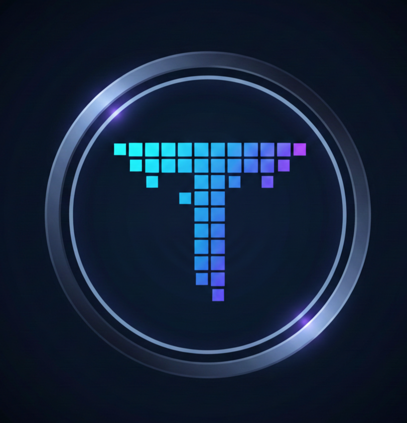

# Tenix

> The name **Tenix** comes from the default **10 × 10 pixel** cell size that forms the LED matrix — _ten_ pixels, _Tenix_.

Tenix is a browser-based, programmable LED matrix simulator. It turns your entire browser window into a grid of virtual LEDs that you can draw on, fill with patterns, animate, and play back — all rendered in real time on an HTML Canvas.



---

## Features

### Drawing Tools

- **Draw** — paint individual cells with the active colour
- **Erase** — clear cells back to black
- **Fill** — flood-fill contiguous regions of the same colour

### Colour Picker

Pick any colour using an inline colour wheel. The active colour is persisted across sessions.

### Patterns

13 one-click pattern presets fill the entire grid instantly:

| Pattern       | Description                                                    |
| ------------- | -------------------------------------------------------------- |
| Checkerboard  | Alternating black & coloured cells                             |
| Gradient      | Custom two-colour gradient (horizontal, vertical, or diagonal) |
| Rainbow H / V | Horizontal or vertical rainbow spectrum                        |
| Noise         | Random coloured pixels                                         |
| Plasma        | Sinusoidal colour waves                                        |
| Spiral        | Colour spiral from centre                                      |
| Border        | Coloured frame around the edge                                 |
| Stripes V / H | Vertical or horizontal stripe bands                            |
| Dots          | Evenly spaced dot grid                                         |
| Crosshatch    | Criss-cross line pattern                                       |
| Diamond       | Concentric diamond shapes                                      |

The **Gradient** pattern opens an inline submenu where you pick start/end colours and direction before applying.

### Pixel Text

Type any text and render it onto the grid using a built-in 5×7 pixel font. Supports scaling from 1× to 6× and renders centred on the board.

### Animations

16 content-aware animations that operate on whatever is currently drawn:

| Animation                       | FPS | Description                           |
| ------------------------------- | --- | ------------------------------------- |
| Replay Draw                     | 30  | Replays your drawing strokes in order |
| Replay Loop                     | 30  | Loops the replay continuously         |
| Replay Reverse                  | 30  | Replays strokes in reverse            |
| Pulse                           | 30  | Brightness pulsing effect             |
| Rainbow Cycle                   | 25  | Cycles hue across all lit pixels      |
| Scroll Left / Right / Up / Down | 15  | Scrolls the content in a direction    |
| Blink                           | 8   | On/off blinking                       |
| Glow                            | 20  | Soft glow oscillation                 |
| Color Wave                      | 25  | Travelling colour wave                |
| Sparkle                         | 15  | Random pixel sparkling                |
| Fade In                         | 30  | Gradual fade from black               |
| Invert Flash                    | 10  | Alternating colour inversion          |
| Matrix Reveal                   | 20  | Column-by-column reveal effect        |

Animations preserve the original content — stopping restores your artwork.

### Undo

Undo drawing actions with **Ctrl+Z** (up to 50 steps).

### Persistence

Your grid data, active colour, tool, and grid-line preference are saved to `localStorage` and restored on reload.

### Responsive & Fullscreen

- The grid dynamically resizes to fill the viewport using a `ResizeObserver`
- A **fullscreen button** (bottom-right) enters fullscreen mode — it hides itself once you're in fullscreen
- The cursor auto-hides after 5 seconds of inactivity for a clean display

### Stroke Recording

Every drawing stroke is recorded as `(col, row)` coordinates, making replay animations resilient to window resizes.

---

## Tech Stack

| Layer     | Technology                                               |
| --------- | -------------------------------------------------------- |
| Framework | [Next.js](https://nextjs.org) 16 (App Router, Turbopack) |
| Language  | TypeScript                                               |
| UI        | React 19, Tailwind CSS 4                                 |
| Rendering | HTML5 Canvas (direct 2D context)                         |
| State     | React hooks + refs (no external state library)           |
| Storage   | `localStorage` for persistence                           |

---

## Getting Started

```bash
# Install dependencies
npm install

# Start development server
npm run dev

# Production build
npm run build
npm start
```

Open [http://localhost:3000](http://localhost:3000) in your browser.

---

## Project Structure

```
app/
├── layout.tsx              # Root layout, metadata, fonts
├── page.tsx                # Entry point — renders <LEDBoard />
├── globals.css             # Global styles & Tailwind
├── components/
│   ├── LEDBoard.tsx        # Main orchestrator (grid, undo, animations, fullscreen)
│   ├── Canvas.tsx          # Canvas rendering, input handling, resize observer
│   ├── ControlPanel.tsx    # Collapsible side panel (tools, settings, info)
│   ├── ColorPicker.tsx     # Inline colour picker
│   ├── PatternSelector.tsx # Pattern grid, gradient submenu, text renderer
│   └── AnimationPanel.tsx  # Animation selector & playback controls
├── lib/
│   ├── grid.ts             # GridManager — flat Uint8ClampedArray data model
│   ├── patterns.ts         # 13 pattern generator functions
│   ├── animations.ts       # 16 animation tick functions
│   ├── animation.ts        # AnimationManager — rAF loop with FPS control
│   ├── recorder.ts         # StrokeRecorder — records draw strokes for replay
│   ├── font.ts             # 5×7 pixel font & text rendering
│   └── utils.ts            # Colour conversion, base64 encoding helpers
└── types/
    └── index.ts            # Shared TypeScript types & defaults
public/
└── Tenix.png               # App icon
```

---

## License

MIT
